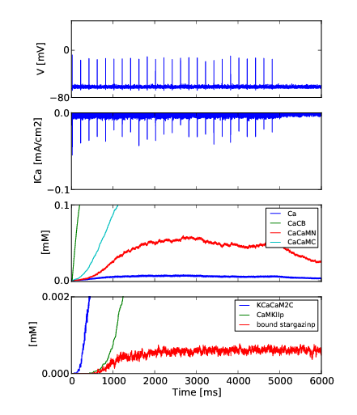
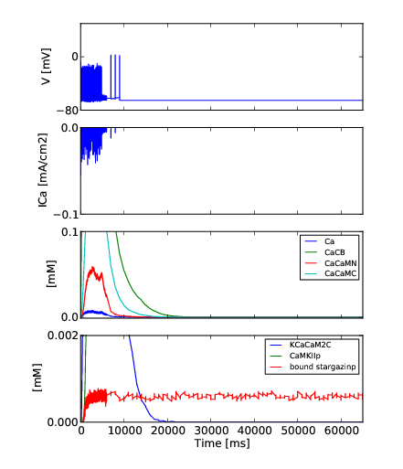

KappaNEURON
===========

KappaNEURON integrates the [SpatialKappa][SpatialKappa] simulator with
[NEURON][NEURON] to allow rule-based simulations of molecular systems
embedded in neurons.

For example, the package facilitates simulation of dynamic models of
the postsynaptic proteome in the context of the spine head.




Publications
------------

Please cite Sterratt & al. (2015) when using KappaNEURON:

* Sterratt, D. C., Sorokina, O. and Armstrong,
  J. D. (2015). ‘Integration of rule-based models and compartmental
  models of neurons’. Lecture Notes in Bioinformatics 7699: 143-158.
  Presented to the Third International Workshop on Hybrid Systems
  Biology Vienna, Austria, July 23-24, 2014 at the International
  Conference on Computer-Aided
  Verification 2014. [doi:10.1007/978-3-319-27656-4_9](http://dx.doi.org/10.1007/978-3-319-27656-4_9).  Preprint at <a title="Abstract"
  href="http://arxiv.org/abs/1411.4980">arXiv:1411.4980</a>
* [Presentation given to Hybrid Systems Biology 2014](doc/2014-07-24-rb-compartmental-method.pdf)

Installation & testing
------------------------

1. Install NEURON v. 7.4 with python enabled using [these instructions
   for Ubuntu 18.04][INSTALL-neuron]

2. Create a virtual environment:
   ```
   sudo apt install virtualenv
   virtualenv --python=python2.7 /tmp/KappaNEURON
   source /tmp/KappaNEURON/bin/activate
   ```

3. Run `pip install KappaNEURON`

4. Run an inital test:
   ```
   python2.7 -i -m unittest KappaNEURON.tests.TestCaAccumulation.test_injectCalcium
   ```
   The test should return `OK` and the following figure window should
   appear
   
   The figure will be saved in PNG format to the directory
   `test_figs`.

5. At present is not possible to run the entire test suite in one go,
   because completely clean tear down of the test environoment is not
   possible with the current version of KappaNEURON. Therefore
   individual tests can be run as follows:
   ```
	python2.7 -m unittest KappaNEURON.tests.TestCaAccumulation.test_injectCalciumGHK
	python2.7 -m unittest KappaNEURON.tests.TestCaAccumulation.test_injectCalciumPump
	python2.7 -m unittest KappaNEURON.tests.TestCaAccumulation.test_injectCalciumPumpGHK
	python2.7 -m unittest KappaNEURON.tests.TestCaAccumulation.test_injectCalciumPump2
	python2.7 -m unittest KappaNEURON.tests.TestCaAccumulation.test_injectCalciumPump2k2
	python2.7 -m unittest KappaNEURON.tests.TestCaAccumulation.test_twoMembraneSpecies
	python2.7 -m unittest KappaNEURON.tests.TestCaAccumulation.test_twoMembraneSpeciesOneUncharged
   ```

   Most of these tests save figures to `test_figs`. The red ("mod")
   and blue ("kappa") curves in these figures should more-or-less
   overlap. The kappa curves will be more irregular, because of the
   stochstic simulation.

KappaNEURON has been tested on the following combinations of software:

| KappaNEURON | OS           |   gcc | Python | Java      |   py4j | NEURON                                              | 
|-------------|--------------|-------|--------|-----------|--------|-----------------------------------------------------| 
|       0.1.0 | Ubuntu 14.04 | 4.8.4 |    2.7 | openjdk 7 | 0.10.4 | trunk of  NEURON mercurial repository on 2014-09-23 | 
|       0.2.0 | Ubuntu 14.04 | 4.8.4 |    2.7 | openjdk 7 | 0.10.4 | 7.4 as of 2017-01-13                                | 
|       0.2.0 | Ubuntu 16.04 | 5.4.0 |    2.7 | openjdk 7 | 0.10.4 | 7.4 as of 2017-01-13                                |
|       0.3.x | Ubuntu 18.04 | 5.4.0 |    2.7 | openjdk 7 | 0.10.4 | 7.4 as of 2017-01-13                                |

Getting started
---------------

Code for the two demo simulations in Sterratt & al. (2015) paper are
the `demos` subdirectory:
1. [Calcium pump in response to calcium pulse](demo/ca_pulse)
2. [Ca-CaM-CaMKII pathway in the postsynaptic density](demo/psd)

Authorship & License
--------------------

KappaNEURON is Copyright © 2013-2014, 2017 David C. Sterratt
<<david.c.sterratt@ed.ac.uk>> and is released under the
[GPL Version 3](http://www.gnu.org/copyleft/gpl.html).

We thank Anatoly Sorokin for his help with SpatialKappa and Vincent
Danos for helpful discussions.

Acknowledgements
----------------

The research leading to these results has received funding from the
European Union Seventh Framework Programme (FP7/2007-2013) under grant
agreement nos. 241498 (EUROSPIN project), 242167 (SynSys-project) and
604102 (Human Brain Project). 

[SpatialKappa]: https://github.com/davidcsterratt/SpatialKappa "SpatialKappa"

[NEURON]: http://neuron.yale.edu/neuron/ "NEURON"

[INSTALL-neuron]: doc/INSTALL-neuron.md "NEURON installation instructions"

<!--  LocalWords:  KappaNEURON SpatialKappa KappNEURON Sterratt Danos
 -->
<!--  LocalWords:  Anatoly Sorokin FP EUROSPIN SynSys
 -->
